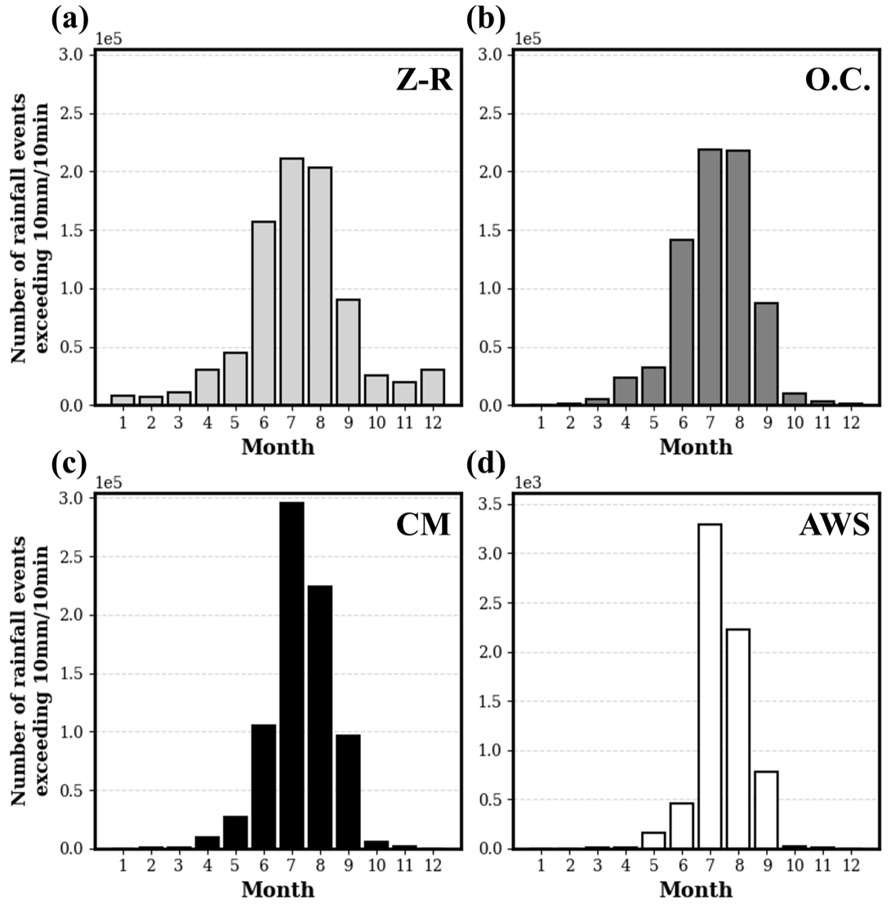
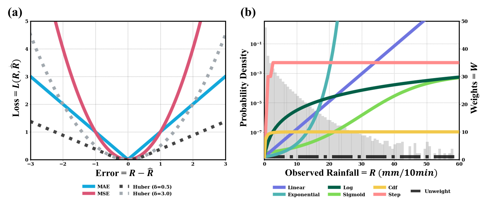
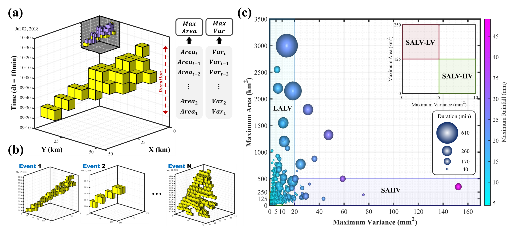
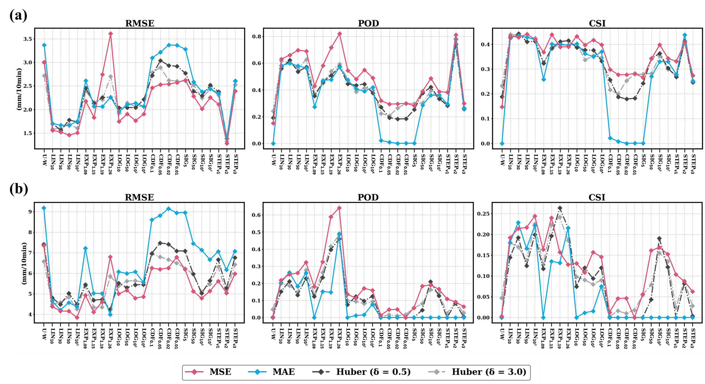
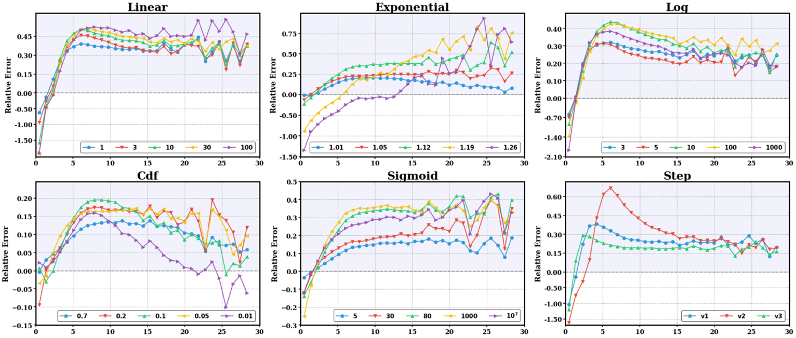
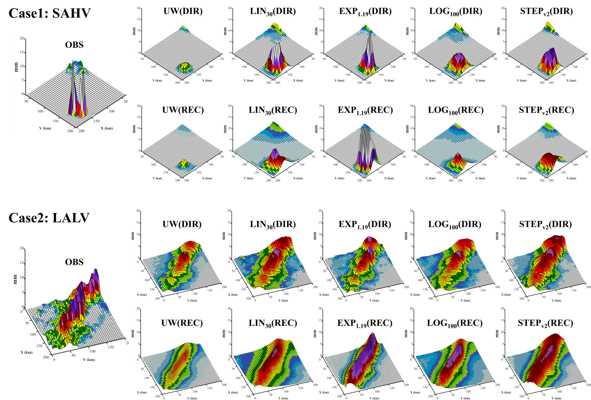
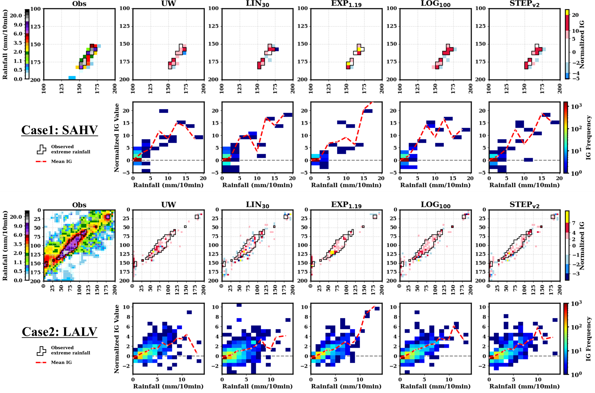

# Unveiling the Role of Weighted Loss Functions in Deep Learning-based Nowcasting of Extreme Rainfall Events (IEEE TGRS 2025)

This repository contains the code and resources to reproduce the experiments in our paper, which investigates how various **weighted loss functions** can improve the real-time prediction of extreme rainfall events using a ConvLSTM nowcasting model.

## 🚀 Overview

Nowcasting is vital for disaster response (e.g. flash floods), but rare **extreme rainfall** events are often under-predicted due to data imbalance. We introduce six weight functions (Linear, Exponential, Logarithmic, CDF, Sigmoid, Step) combined with standard loss functions (MSE, MAE, Huber) to penalize large errors more heavily as intensity increases. Detailed evaluation by intensity interval and spatial event type shows that **no single weight** is optimal for all cases—trade-offs can be leveraged to **select the best model** for a given prediction goal.

## 📊 Data

- **Radar**: KMA CMAX composite (1 km → upscaled to 5 km) over central South Korea (2009–2018)  
- **Gauge**: 538 AWS stations for quality control and conditional merging  
- **Preprocessing steps** :

  1. Reflectivity → Rainfall (Marshall–Palmer Z–R)  
  2. Outlier correction [doi:10.1109/TGRS.2024.3366400](https://doi.org/10.1109/TGRS.2024.3366400) 
  3. Radar–gauge merging (CM)  
  4. Upscaling to 5 km  

## 🔧 Methodology

- **Model**: ConvLSTM (3 layers, 32 filters, tanh, Adam) with ensemble of 3 runs  
- **Weighted Loss**:
  - **Loss**: MSE, MAE, Huber (δ=0.5, 3.0)  
  - **Weight**:  
    - **Linear** (LINα)  
    - **Exponential** (EXPα)  
    - **Logarithmic** (LOGα)  
    - **CDF** (CDFα)  
    - **Sigmoid** (SIGα)  
    - **Step** (STEPv1–v3)  

- **Long-term Prediction**:  
  - **Recursive** vs. **Direct** (lead times up to 90 min)  
- **Event Types**:  
  - LALV (Large Area & Low Variance)  
  - SAHV (Small Area & High Variance)  
  - SALV-LV, SALV-HV
    

## 📈 Key Results

- **Weighted models** outperform the unweighted baseline on RMSE, POD, CSI for extreme rainfall intervals (5–10 mm, >10 mm).
   
  
  
- **Interval-specific trade-offs**:  
  - **STEPv2** excels around 5 mm/10 min  
  - **EXP1.19** and **EXP1.26** best for >15 mm/10 min
   
  
  
- **Event-type guidance**:  
  - **High-variability** (SAHV, SALV-HV): EXP1.12, SIG80, SIG1000  
  - **Low-variability** (LALV, SALV-LV): LIN30, LIN100, STEPv2, EXP1.19  
  - **Stable** across types: LOG10, LOG100
   
  

- **Prediction horizon**:  
  - **Direct** method wins for high-variability events  
  - **Recursive** method works better for LALV
   
  

- **Interpretability** via **Integrated Gradients** reveals that sharper weight curves (e.g. EXP) focus feature importance on high-intensity pixels
  
   
  

